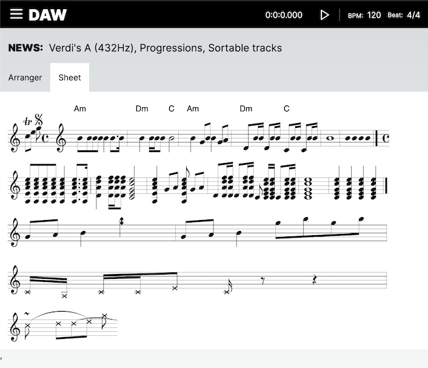
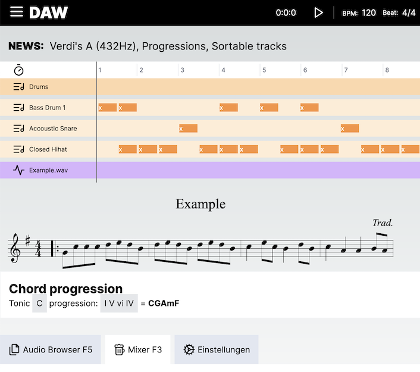
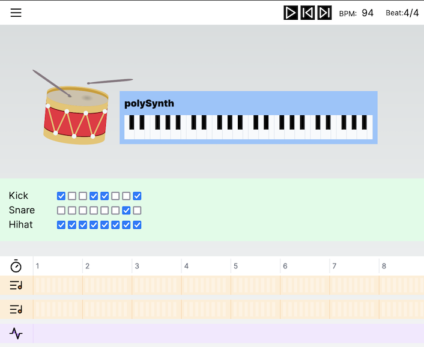

# DAW

**D**igital **A**udio **W**orkstation using [Tone.js](https://github.com/Tonejs/Tone.js)

<span style='background:#aaffbb;color:#333;padding:8px 20px;'>🎼 open-source! ...sounds good?</span>

## Quickstart

Assuming you have [Node.js](https://nodejs.org) installed...

```bash
npm i && npm run dev
```

🥁 [localhost:3000](http://localhost:3000)

## Collaboration

---

## 🙏 Thank you!<br>

### \\/\\/r|te /\\/\\e: [@LinkedIn](https://www.linkedin.com/in/faebster/)

---

## Changelog

### August 2023

#### Day 24

**Jest Setup** using Rust compiler

**Locator & Transport** play/stop

**Audio to MIDI** detect instruments & notes using [basic-pitch](https://github.com/spotify/basic-pitch-ts)

**Music sheet generation from audio file (e.g. .mp3, .wav, ...)**

## 

---

#### Day 22

**Arranger** DnD tracks

**Locator** visualize transport position

**MultiLanguage** de, en, fr, it

**Sheets** generate sheets of music using [abcjs](https://github.com/paulrosen/abcjs)

**pfui (pretty futuristic UI's)** Tabs



---

#### Day 09

**Tone.js** basic synths & fx, transport (playback), etc.

**Tonal.js** detect progression of tonic with roman number input

**AdioKeys** Use the keyboard as a MIDI controller

**pfui (pretty futuristic UI's)** Accordion, Anchor, Dialog, List, Message, Nav

**useVerdisA** hook to tune synths to `A4: 432hz`


