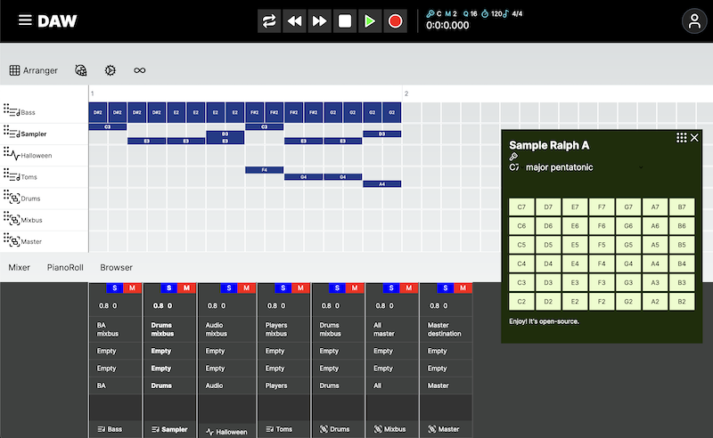
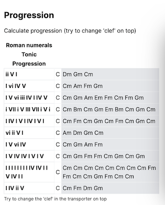
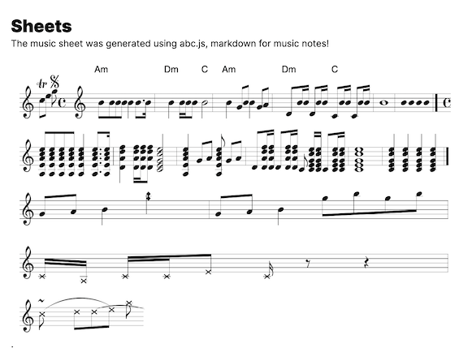

# Digital Audio Workstation

[](https://github.com/scha-ch/daw/actions/workflows/ci.yaml)

---

## Kauderwälsch

There are some terms/abbreviations used in the code, here the list:

| Const | Meaning | Description      | Reason                                  |
| ----- | ------- | ---------------- | --------------------------------------- |
| $     | css     | Component styles | reserved, DI\* planned                  |
| $d    | data    | Component data   | reserved, DI\* planned                  |
| $e    | event   | Component event  | reserved, elsewhere placed should throw |

\* Dependency Injection

## 🎼Quickstart

Assuming you have [Node.js](https://nodejs.org) installed...

```bash
npm i && npm run dev
```

🥁 [localhost:3000](http://localhost:3000)

---

## Table of contents

- [🎼Platform strategy](src/app/core/instruments/README.md#platformStrategy)
- [🎼Instruments](src/app/core/instruments/README.md#)

- [🎼PFUI design](src/app/ui/README.md#)

---

## Vision

### Free & open-source

This platform will be free to use for everyone, and it will be open-source. Of course we'd like to offer you additional services that could come with a price tag, but the core of the platform will always be free.

### Compose, arrange, record, mix & master

Yeah. It's a DAW, right?

### Intuitive & AI supported workflow

The platform will help you while you're working on your project. E.g. you can turn on rules that will warn you if you are out of tune, or transpose your music to a different key. You can also tune the instruments to Verdi's A4 (432Hz) with one simple click if you like to.

There will be tons of free samples, grouped by tons of genres, there will be live workshops while you're creating your next hit. You can also collaborate with other musicians, share events and much more.

### Vision: eLearning

#### Audio-Engineer

You will learn how to master the art of mixing, there will be many chapters with different topics, like: Harmonic EQ'ing, Psycho Acoustic, New York Compression, Cambridge HPF, etc.

_**Did you know?** The SM57 & SM58 live microphones mainly used for vocals on live concerts sound great to record an electical guitar! The SM57 will give you a more direct sound, the SM58 sounds more airy instead._

#### Learn to play an instrument

You will learn how to play an instrument, the better you become the more influence in the online community you will learn build & maintain. You will learn about existing playing styles, and there will be exercises like online games to play with other musicians.

#### (Game-) Sound Design

You will learn how to compose sound to movies/game and how to create sound from scratch. This includes Foley and orchestration, how to design emotion for the listener and plan your project like a pro.

Did you know? If you press `E` & `F` on your piano in all octaves fast and furious, you can see Tom haunting Jerry. If you play them upwards (EF EF EF EF) it will increase the tension, vice verca Tom has already resigned catching that Meow!

## 🎼Contribution

```typescript
/**
 * You like coding?
 * You are a musician</>
 * You like music
 */
export default function Collabo() {
  return EMotion.Perfect;
}
```

We're [@here](https://github.com/scha-ch/daw/discussions) 🙋‍♂️ and [@there](https://www.linkedin.com/in/faebster/)

---

## 🎼Screenshots

Design will be applied soon, this is just a raw sketch!



<div style='display:flex;flex-direction:row;gap:4rem'>





</div>

---

## 🎼Changelog

### 🍂 October 2023

#### 19th

- **Pfui Menu/ContextMenu** one4all menu. Bind a Menu/Contextmenu to an target area

#### 14th

- **Mixer** FFT Analyzers for all tracks
- **Cypress** Component & E2E tests (removed Jest)

#### 13th

- **Progression** Show famous chord progressions by tonic (try to change clef on top)
- **E2E Testing** using Cypress, also integrated into CI pipeline & first test for DnD useSortable tracks (Arranger)

#### 12th

- **Arranger** Players & Sampler can play Tone.Sequence
- **Samples** added new sample library

#### 7th

**Parts of Sequences** playable in `Players` and `Sampler`
**Free Samples** updated to the public domain

#### 5th

- **Github Workflow** lint, test & build on 'main' push & PR (matrix strategy)

#### 4th

- **Arranger** Quantization grid & playing sequences
- **SWR 'Selector'** to handle unserializable data

### 🍃 September 2023

#### 29th

- **Portals** The instruments are loaded at the same location via `usePortal` hook
- **Refactoring** of the whole project (more soon, project 2 months young)
- **Navbar Redesign** redesign & new: update measureCount & quantization
- **Sampler playable** open the instrument via the 'routing' input field in the mixer
- **Arranger & Mixer auto-resize** throttled update on window resize
- **Browser** Media browser tab, ready to be filled with provided free samples

#### 23th

- **BPM Detection** works, audio tracks are automatically analyzed
- **MIDI Device** support for Chrome, more to follow (Tab 'Settings')

#### 20th

- **Add/remove notes** in MIDI tracks

#### 15th

- **Mixer** Volume meter, ready to add inserts/sends
- **SWR** Instruments are now loaded with ProjectContext

#### 13th

- **Store project settings** using SWR
- **Arranger** playback (drums)

### ☀️ August 2023

#### 24th

- **Jest Setup** using Rust compiler
- **Locator & Transport** playable sound
- **Basic Pitch AI** to analyse audio files to generate:
- **Generate song sheets** using [ABC.js](https://github.com/paulrosen/abcjs)

#### 22th

- **Arranger** DnD tracks
- **Locator** visualize transport position
- **MultiLanguage** `🇨🇭` `🇩🇪` `🏴󠁧󠁢󠁥󠁮󠁧󠁿` `🇫🇷` `🇮🇹`

#### 9th

- **Basic Synths & FX** using Tone.js
- **Transport** (playback, bpm).
- **Chord Progression** generated by tonic & roman letter input
- **AudioKeys** use your keyboard as a MIDI device
- **Verdi's A** a hook to tune ♩A4 of instruments to 432hz
- **PFUI** Pretty Futuristic UI
